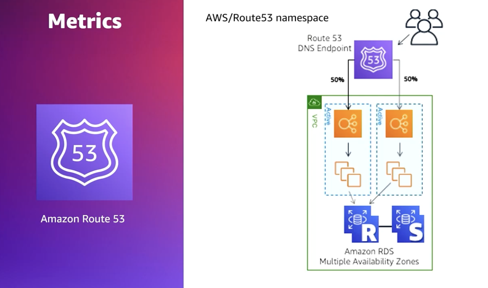
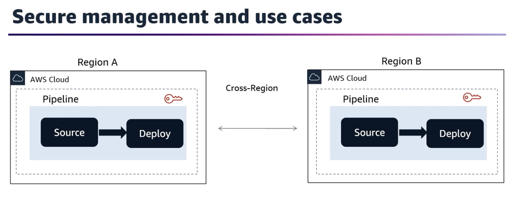

### Domain 1: SDLC Automation
#### Implement CI/CD pipelines.
**SDLC lifecycle**
1. Define requirement, goal, and timelines.
2. Create a design plan.
    - includes: entire architecture, features, infrastructure requirement, user interface, and security.
3. Create source code.
4. Add testing.
5. Deploy the tested version.
6. Setup automation, monitor, and add new features.

CI/CD is a set of practices and methods that speed up the software delivery by adding automation into SDLC.

#### 1.2 Integrate automated testing into CI/CD pipelines.
- Review automated testing in the exam prep for Developer Associate

- https://aws.amazon.com/prescriptive-guidance/
- https://docs.aws.amazon.com/prescriptive-guidance/latest/load-testing/welcome.html?did=pg_card&trk=pg_card

- Route 53 healthcheck and metrics: what it is? Why do we need it? How it work?

   

what it is? Why do we need it? How it work? AWS System Manager, Run Command

#### 1.3 Build and manage artifacts.

- Code deploy will use a load balancer with two target groups

- How do you add cross region actions in your pipeline?

#### 1.4 Implement deployment strategies for instance, container, and serverless environments.

- How, when, why to use difference deployment methods:
  - Blue/green
  - Canary
  - Immutable
  - Rolling
  - Rolling with additional batch
  - In Place
  - Linear
  - All-at-one

Relevant topic:
- https://nghethuatcoding.com/2019/05/06/cac-ki-su-grab-da-thiet-ke-he-thong-dan-hoi-su-dung-circuit-breaker-nhu-the-nao/

- What is the hooks of each deployment methods?
- Lambda versioning, alias

- Troubleshooting deployment issue
  - ingress egress of security group
  - vpc flow log???

**Tutorial:** https://docs.aws.amazon.com/codepipeline/latest/userguide/tutorials.html

