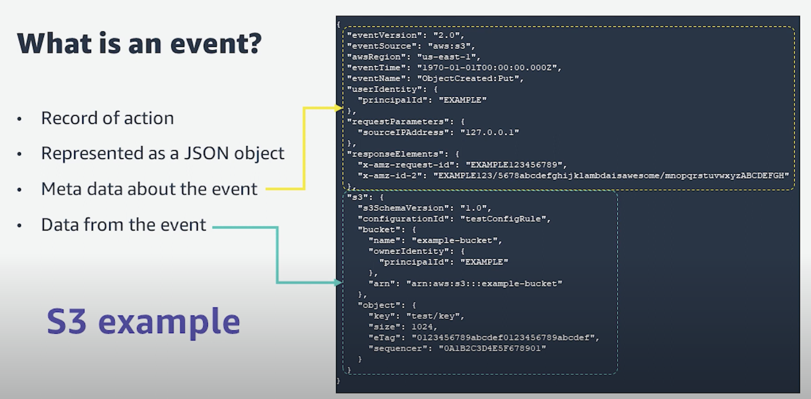
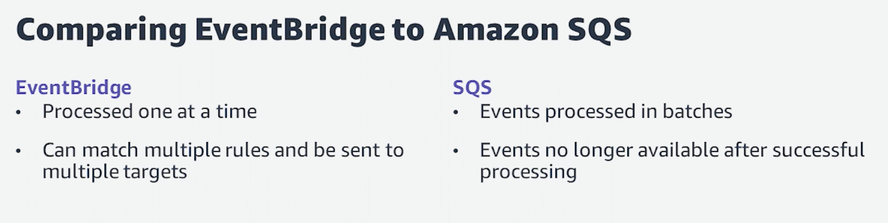
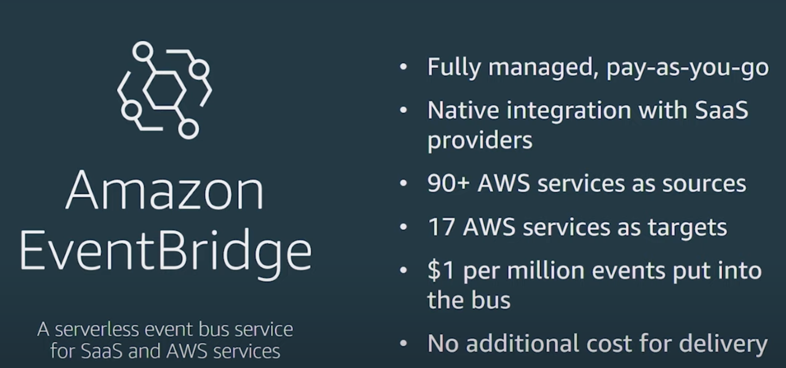
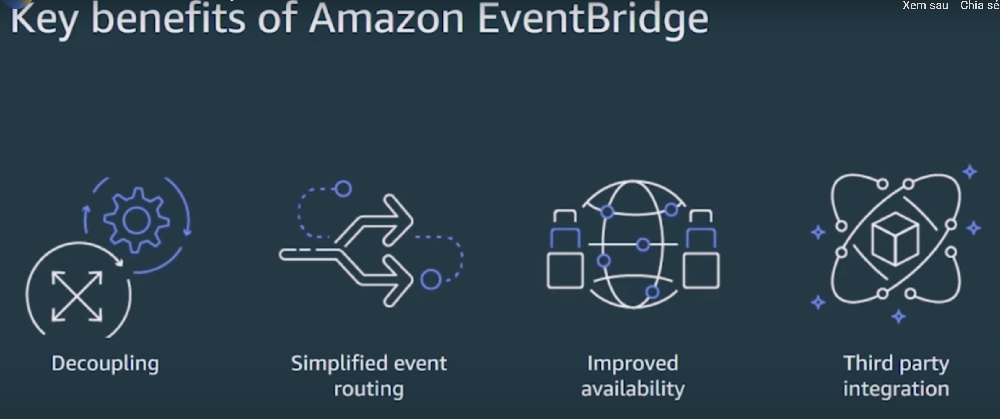
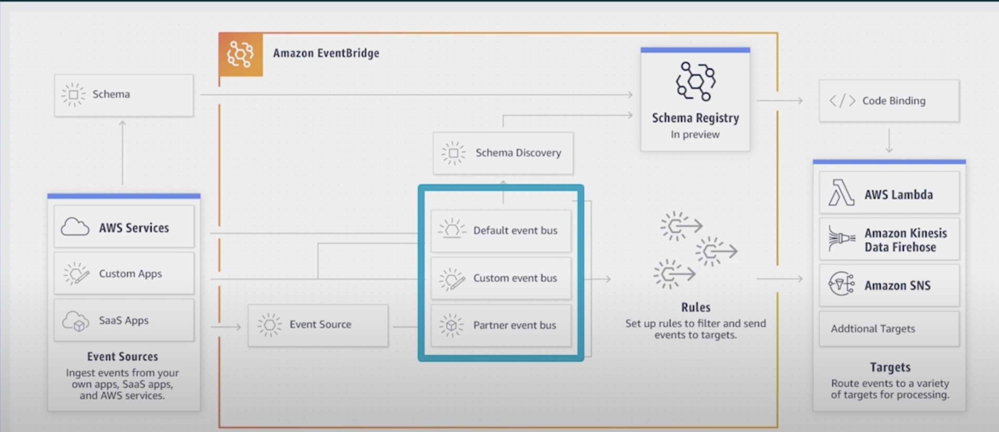

## EventBridge

### Tutorial
#### EventBridge
- [1. Intro to Amazon EventBridge](https://www.youtube.com/watch?v=5K6qpMOVS0E)

- [2. How to get started with Amazon EventBridge](https://serverlessland.com/learn/eventbridge)

#### EventBridge Pipes
- https://serverlessland.com/eventbridge-pipes

#### EventBridge Scheduler
- https://serverlessland.com/eventbridge-scheduler

### Exercise
- Create a default bus, AWS S3 put object to bucket -> trigger a lambda function
- Create a custom bus, Order Service in Lambda -> EventBridge -> Invoice Service in Lambda
  - Cloud9
  - SAM
    - sam build
    - sam deploy --guided
    - sam logs -n [functionName] --stack-name [stackName] -t 
  - Lambda
    - aws lambda invoke --function-name [function-name] output.txt
  - Example: https://github.com/jbesw/eventbridge-sam-example
- Learn how to use Schema Registry
- Install AWS Toolkit VScode
  - Download codebinding of a schema

### Interesting things
- [Dead letter queue](https://aws.amazon.com/what-is/dead-letter-queue/?nc1=h_ls) 
- [What is an Event-Driven Architecture?](https://aws.amazon.com/event-driven-architecture/)

