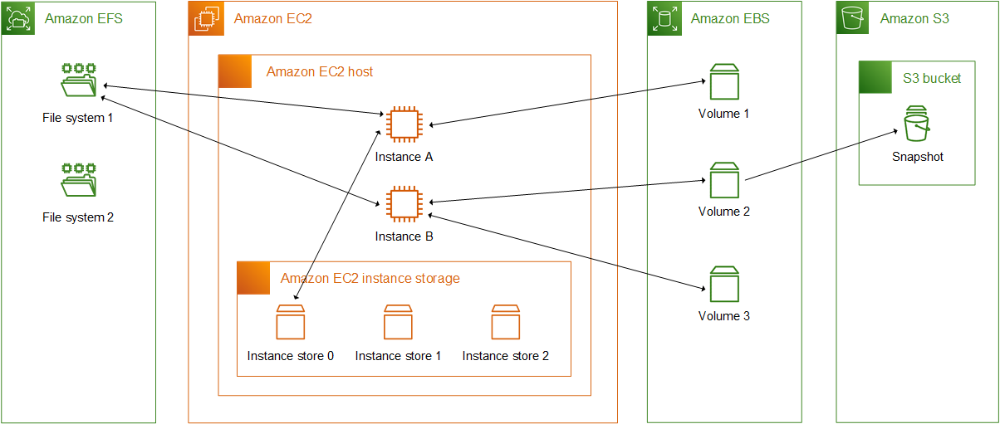
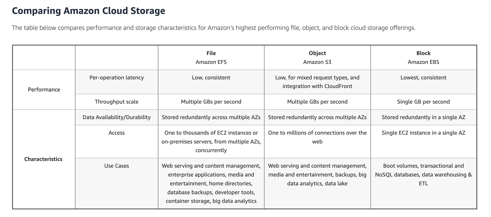
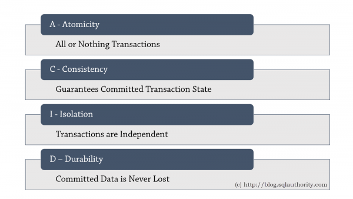

# What Is the Difference Between EBS, EFS, and Instance Store?

Some Amazon EC2 instance types come with a form of directly attached, block-device storage known as an instance store. Use the instance store for temporary storage. Data that's stored in instance store volumes isn't persistent through instance stops, terminations, or hardware failures.

For data that you want to retain longer, or if you want to encrypt the data, use Amazon EBS volumes instead. EBS volumes have the following features:

- EBS volumes preserve their data through instance stops and terminations.
- You can back up EBS volumes with EBS snapshots.
- You can remove EBS volumes from one instance, and reattach them to another.
- EBS volumes support full-volume encryption.

**Note:** In Amazon EBS, the DeleteOnTermination attribute for an instance's root volume is set to true by default. If you don't change this attribute, then the instance's root volume is deleted when the instance terminates.

Amazon EFS provides shared file storage for use with compute instances in the AWS Cloud and on-premises servers. Applications that require shared file access can use Amazon EFS for reliable file storage delivering high aggregate throughput to thousands of clients simultaneously. **Note:** Amazon EFS provides scalable file storage for use with Amazon EC2.

### AWS FSx

**Scratch File System** 
- Temporary storage

**Persistent File System**
- Long-term storage

TCO: Total Cost of Ownership(an estimate of all the direct and indirect costs involved in acquiring and operating a product or system over its lifetime)

#### ACID
- ACID (atomicity, consistency, isolation, durability) is a set of properties of database transactions intended to guarantee data validity despite errors, power failures, and other mishaps.

- Atomic: Transactions are often composed of multiple statements. Atomicity guarantees that each transaction is treated as a single "unit", which either succeeds completely or fails completely: if any of the statements constituting a transaction fails to complete, the entire transaction fails and the database is left unchanged. An atomic system must guarantee atomicity in each and every situation, including power failures, errors, and crashes. A guarantee of atomicity prevents updates to the database from occurring only partially, which can cause greater problems than rejecting the whole series outright. As a consequence, the transaction cannot be observed to be in progress by another database client.

Source:
- https://docs.aws.amazon.com/AWSEC2/latest/UserGuide/Storage.html
- https://aws.amazon.com/efs/when-to-choose-efs/
- https://docs.aws.amazon.com/AWSEC2/latest/WindowsGuide/AmazonEFS.html
- https://aws.amazon.com/vi/fsx/
- https://aws.amazon.com/s3/storage-classes/
- https://en.wikipedia.org/wiki/ACID
- 